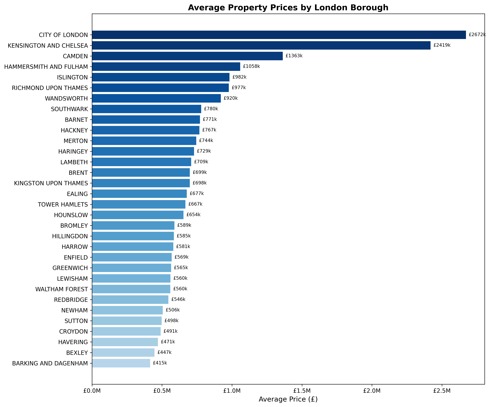
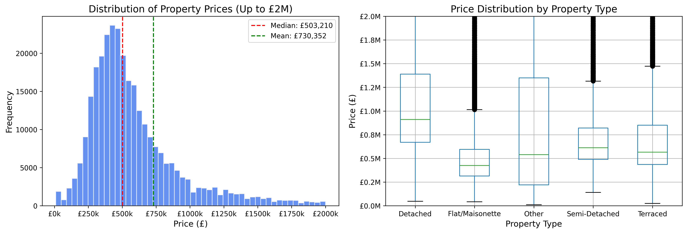
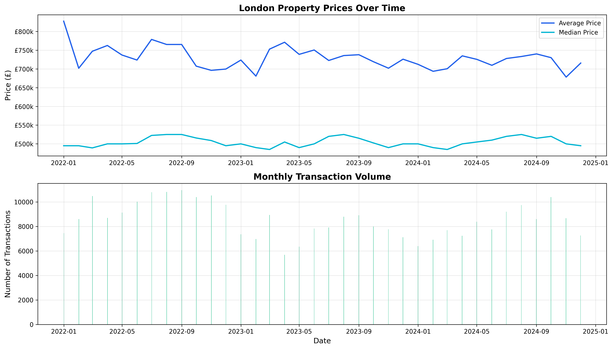
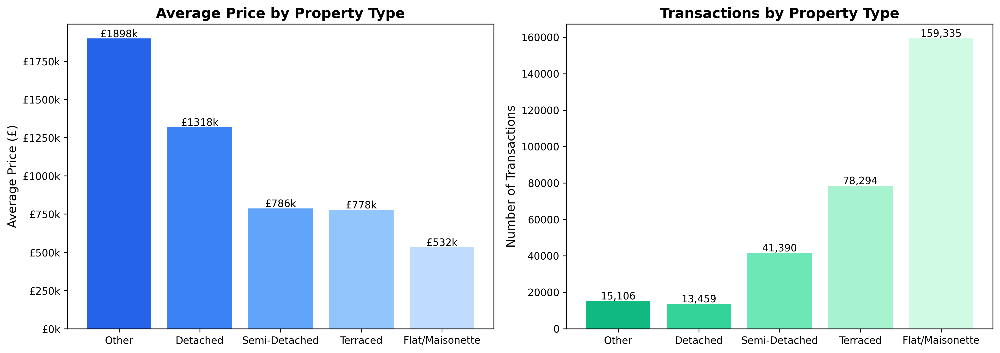
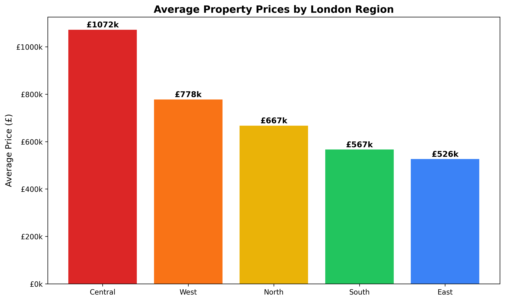
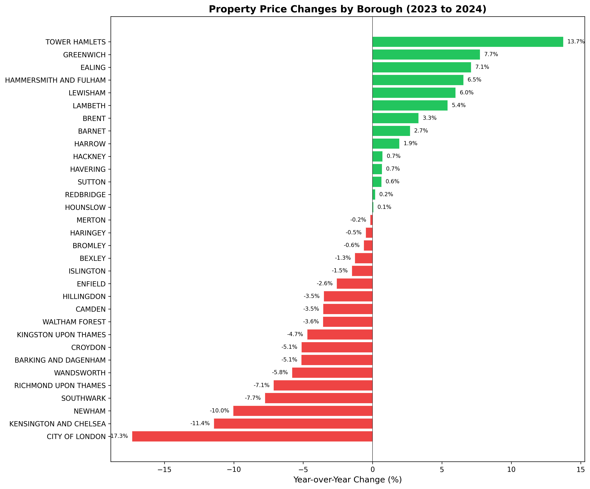

# 🏠 UK Housing Market Analysis

[](https://python.org)
[](https://sqlite.org)
[]()

## 📋 Overview

Comprehensive analysis of the **London housing market** using HM Land Registry Price Paid Data. This project analyses **307,584 property transactions** across all 33 London boroughs to uncover pricing trends, regional variations, and market insights.

---

## 🔑 Key Findings

| Metric | Value |
|--------|-------|
| **Total Transactions Analysed** | 307,584 |
| **Most Expensive Borough** | City of London (£2.67M avg) |
| **Most Affordable Borough** | Barking & Dagenham (£415k avg) |
| **Price Gap** | 6.4x between highest and lowest |
| **Most Active Borough** | Wandsworth (18,228 transactions) |

### Top 5 Most Expensive Boroughs
1. 🥇 **City of London** - £2,671,636
2. 🥈 **Kensington & Chelsea** - £2,419,094
3. 🥉 **Camden** - £1,362,680
4. **Hammersmith & Fulham** - £1,058,494
5. **Islington** - £982,479

### Top 5 Most Affordable Boroughs
1. **Barking & Dagenham** - £414,990
2. **Bexley** - £446,939
3. **Havering** - £471,325
4. **Croydon** - £490,638
5. **Sutton** - £497,510

---

## 📊 Visualisations

### Borough Price Comparison

*Average property prices across all 33 London boroughs*

### Price Distribution

*Distribution of property prices and breakdown by property type*

### Price Trends Over Time

*Monthly average prices and transaction volumes*

### Property Type Analysis

*Price comparison across different property types*

### Regional Comparison

*Central, North, South, East, and West London comparison*

### Year-over-Year Changes

*Price changes by borough compared to previous year*

---

## 🛠️ Technical Stack

| Component | Technology |
|-----------|------------|
| **Data Processing** | Python, Pandas, NumPy |
| **Database** | SQLite |
| **Visualisation** | Matplotlib, Seaborn |
| **Data Source** | HM Land Registry |

---

## 📁 Project Structure

```
uk-housing-market/
├── README.md
├── requirements.txt
├── data/
│   ├── raw/                      # Original HM Land Registry data
│   ├── processed/                # Cleaned London data
│   └── housing_market.db         # SQLite database
├── src/
│   ├── 01_download_data.py       # Data download script
│   ├── 02_data_cleaning.py       # Data cleaning & processing
│   └── 03_run_analysis.py        # Analysis & visualisation
├── sql/
│   └── queries.sql               # SQL analysis queries
└── outputs/
    ├── 01_price_distribution.png
    ├── 02_borough_prices.png
    ├── 03_price_trends.png
    ├── 04_property_types.png
    ├── 05_regional_comparison.png
    ├── 06_yoy_changes.png
    └── borough_summary.csv
```

---

## 🚀 How to Run

### Prerequisites
- Python 3.9+
- pip

### Installation

```bash
# Clone the repository
git clone https://github.com/mounishmesa/mounishmesa.github.io.git
cd mounishmesa.github.io/projects/uk-housing-market

# Install dependencies
pip install -r requirements.txt

# Download and process data
python src/01_download_data.py
python src/02_data_cleaning.py

# Run analysis
python src/03_run_analysis.py
```

---

## 📈 Sample SQL Queries

### Average Price by Borough
```sql
SELECT 
    district AS borough,
    COUNT(*) AS transactions,
    ROUND(AVG(price), 0) AS avg_price
FROM transactions
GROUP BY district
ORDER BY avg_price DESC;
```

### Year-over-Year Price Change
```sql
WITH yearly_avg AS (
    SELECT year, district, AVG(price) AS avg_price
    FROM transactions
    GROUP BY year, district
)
SELECT 
    curr.district,
    ROUND((curr.avg_price - prev.avg_price) / prev.avg_price * 100, 2) AS yoy_change
FROM yearly_avg curr
JOIN yearly_avg prev ON curr.district = prev.district 
    AND curr.year = prev.year + 1
ORDER BY yoy_change DESC;
```

---

## 📊 Data Source

- **Source:** [HM Land Registry Price Paid Data](https://www.gov.uk/government/collections/price-paid-data)
- **License:** Open Government Licence v3.0
- **Coverage:** All residential property sales in England and Wales

---

## 👤 Author

**Mounish Mesa**
- Portfolio: [mounishmesa.github.io](https://mounishmesa.github.io)
- LinkedIn: [linkedin.com/in/mounish-jm](https://www.linkedin.com/in/mounish-jm/)
- Email: mounicar9496@gmail.com

---

## 📄 License

This project is open source and available under the [MIT License](../../LICENSE).

---

*Last Updated: December 2024*
